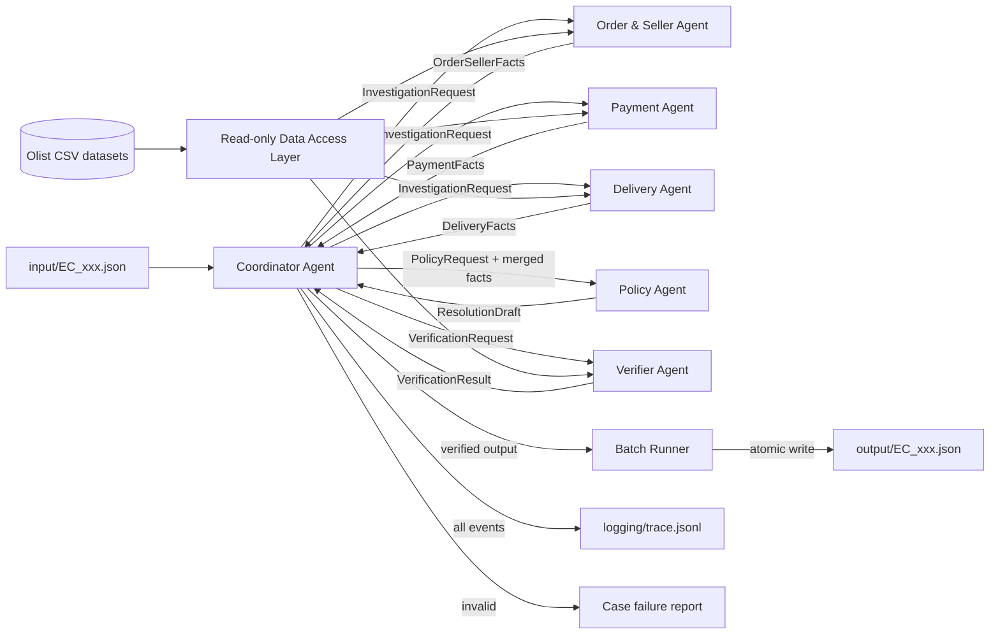
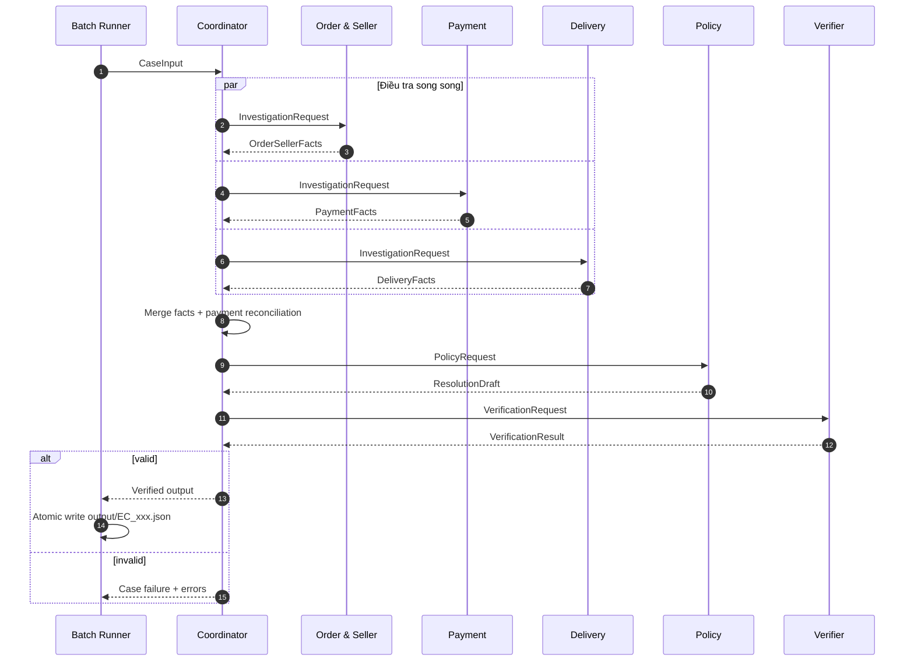

# Product Architecture - Multi-Agent E-commerce Dispute Resolution

## 1. Mục tiêu và phạm vi

Hệ thống xử lý độc lập 50 yêu cầu hỗ trợ trong `input/`, điều tra dữ liệu Olist và tạo một kết quả JSON tương ứng trong `output/`. Mỗi kết luận phải truy vết được về dữ liệu nguồn, tuân thủ `EC_POLICY_V1` và không tạo bằng chứng không tồn tại.

Các mục tiêu chất lượng chính:

- **Correctness:** áp dụng đúng thứ tự ưu tiên của policy và tính tiền chính xác đến 2 chữ số thập phân.
- **Traceability:** mọi kết luận đều có evidence ID và trace handoff giữa các agent.
- **Separation of concerns:** agent điều tra chỉ tạo facts; agent policy ra quyết định; verifier kiểm tra độc lập trước khi ghi file.
- **Reproducibility:** cùng input và cùng dữ liệu phải tạo cùng kết quả, không phụ thuộc vào câu trả lời ngẫu nhiên của model.
- **Batch isolation:** lỗi ở một case không làm mất kết quả hoặc trace của các case còn lại.

Ngoài phạm vi: hệ thống không suy diễn refund ledger, transaction ID, tracking checkpoint theo item, giao sai hoặc giao thiếu vì các dữ liệu này không tồn tại trong bộ Olist.

## 2. Nguyên tắc thiết kế

1. CSV là nguồn sự thật; nội dung khiếu nại chỉ là tín hiệu để bắt đầu điều tra.
2. Tiền, ngày tháng, join và luật nghiệp vụ được xử lý bằng code deterministic.
3. Model dùng bởi agent phải có tối đa 10B parameters. Model không tự tính refund hoặc tự tạo evidence ID.
4. Các agent giao tiếp bằng message có schema rõ ràng, không chia sẻ prompt tự do làm contract.
5. Coordinator chỉ điều phối; không thay thế công việc của các agent chuyên môn.
6. Chỉ ghi output sau khi Verifier trả về trạng thái hợp lệ.
7. Mỗi lần chạy tạo mới `trace.jsonl`, không append trace từ lần chạy trước.

## 3. Sơ đồ tổng thể



Luồng fan-out tới ba investigation agent có thể chạy song song. Policy chỉ chạy sau khi Coordinator nhận đủ ba kết quả. Verifier chỉ chạy sau khi có `ResolutionDraft`.

## 4. Thành phần hệ thống

### 4.1 Batch Runner

Trách nhiệm:

- Đọc đúng 50 file `EC_001.json` đến `EC_050.json` theo thứ tự ổn định.
- Tạo một `run_id` cho toàn bộ lượt chạy và một `trace_id` cho từng case.
- Gọi Coordinator cho từng case; có thể chạy nhiều case song song với concurrency giới hạn.
- Tổng hợp trạng thái thành công/thất bại và chỉ đóng gói submission khi đủ 50 output hợp lệ.
- Khởi tạo mới `logging/trace.jsonl` trước mỗi lượt chạy.

Batch Runner không chứa logic nghiệp vụ.

### 4.2 Coordinator Agent

Trách nhiệm:

- Validate input tối thiểu: `case_id`, `claimed_order_id`, `policy_version`.
- Fan-out yêu cầu điều tra tới Order & Seller, Payment và Delivery Agent.
- Nhận, kiểm tra correlation ID và gộp facts theo `order_id`.
- Chuyển facts hoàn chỉnh cho Policy Agent.
- Chuyển bản nháp kết quả cho Verifier Agent.
- Chỉ trả kết quả đã xác minh cho Batch Runner khi Verifier trả về `valid=true`.
- Ghi trace cho mọi request, response, lỗi và quyết định retry.

Coordinator không được tự truy vấn CSV, tự áp policy hoặc sửa kết quả để vượt qua verifier.

### 4.3 Order & Seller Agent

Nguồn dữ liệu được phép đọc:

- `olist_orders_dataset.csv`
- `olist_order_items_dataset.csv`
- `olist_sellers_dataset.csv`

Trách nhiệm:

- Tìm order bằng `claimed_order_id`.
- Lấy trạng thái order và toàn bộ item của order.
- Giữ đúng quan hệ nhiều item, nhiều seller; không giả định một order chỉ có một item.
- Tính `item_total_brl` và `freight_total_brl` bằng tổng tất cả item row.
- Xác định seller bàn giao muộn bằng cách so sánh `order_delivered_carrier_date` với từng `shipping_limit_date`.
- Dựng candidate evidence cho order, item và seller từ record tồn tại.

Output: `OrderSellerFacts` gồm order facts, danh sách item/seller, tổng item, tổng freight và provenance.

### 4.4 Payment Agent

Nguồn dữ liệu được phép đọc:

- `olist_order_payments_dataset.csv`

Trách nhiệm:

- Lấy toàn bộ payment row theo `order_id`.
- Tính `payment_total_brl`; `payment_value` được cộng một lần cho mỗi row, không nhân với installments.
- Đếm số payment row và giữ `payment_sequential` để dựng evidence.
- Đối soát payment với `item_total_brl + freight_total_brl` trong sai số `0.10 BRL` sau khi nhận totals từ Coordinator.

Output: `PaymentFacts` gồm payment rows, tổng payment, số payment row và trạng thái reconciliation.

Để giữ fan-out song song, Payment Agent thực hiện truy xuất và tính tổng trước. Bước reconciliation có thể được Coordinator bổ sung sau khi nhận `OrderSellerFacts`, hoặc gọi phương thức deterministic thứ hai của Payment Agent.

### 4.5 Delivery Agent

Nguồn dữ liệu được phép đọc:

- `olist_orders_dataset.csv`

Trách nhiệm:

- So sánh `order_delivered_customer_date` với `order_estimated_delivery_date`.
- Xác định `delivered_late`, `delivered_within_estimate` hoặc thiếu timestamp cần thiết.
- Trả về mốc carrier nhận hàng để Policy Agent kết hợp với `shipping_limit_date` từ Order & Seller Agent.
- Không tạo tracking checkpoint vì dataset không có dữ liệu này.

Output: `DeliveryFacts` gồm các timestamp nguồn, kết quả so sánh và provenance.

### 4.6 Policy Agent

Quyền truy cập: chỉ nhận facts từ Coordinator; không đọc CSV và không ghi file.

Trách nhiệm:

- Áp dụng `EC_POLICY_V1` theo đúng thứ tự ưu tiên.
- Chọn duy nhất một `primary_issue`.
- Gán `case_status`, root cause, responsible party, refund và resolution action.
- Chọn evidence IDs từ danh sách candidate có provenance; không tự tạo sự kiện.
- Tạo `ResolutionDraft` đúng output schema.

Decision table bắt buộc:

| Ưu tiên | Điều kiện | Primary issue | Root cause | Refund/action |
|---:|---|---|---|---|
| 1 | `status=canceled` và payment > 0 | `canceled_order_paid` | `ORDER_CANCELED_AFTER_PAYMENT` | Tổng payment / `issue_full_refund` |
| 2 | `status=unavailable` và payment > 0 | `unavailable_order_paid` | `ORDER_UNAVAILABLE_AFTER_PAYMENT` | Tổng payment / `issue_full_refund` |
| 3 | Giao trễ và carrier nhận sau shipping limit | `late_delivery_seller` | `SELLER_HANDOFF_AFTER_LIMIT` | Tổng freight / `refund_freight` |
| 4 | Giao trễ và carrier nhận không sau shipping limit | `late_delivery_logistics` | `CARRIER_DELIVERED_AFTER_ESTIMATE` | Tổng freight / `refund_freight` |
| 5 | Từ 2 payment row và payment khớp order total | `valid_split_payment` | `MULTIPLE_PAYMENTS_RECONCILED` | 0 / `explain_valid_split_payment` |
| 6 | Giao đúng hạn và payment khớp order total | `unsupported_late_claim` | `DELIVERY_WITHIN_ESTIMATE` | 0 / `reject_late_refund` |

Các phép so sánh ngày dùng trực tiếp timestamp trong CSV. Tất cả số tiền output được làm tròn 2 chữ số bằng decimal arithmetic, không dùng binary float cho phép tính trung gian.

### 4.7 Verifier Agent

Quyền truy cập: bản nháp kết quả, facts có provenance và Data Access Layer ở chế độ read-only.

Verifier hoạt động như quality gate độc lập:

- Kiểm tra tên file khớp `case_id` và input.
- Kiểm tra đủ field, đúng type, enum và `confidence` trong `[0, 1]`.
- Kiểm tra giới hạn: tối đa 5 ID/entity set, 10 evidence, 3 root causes, 3 responsible parties và 5 actions.
- Kiểm tra mọi order/item/payment/seller evidence tồn tại trong CSV và đúng định dạng.
- Kiểm tra policy evidence khớp root cause đã chọn.
- Tính lại item, freight, payment và refund từ facts nguồn.
- Kiểm tra `action_required` khi refund > 0; `no_action` khi refund = 0.
- Kiểm tra `primary_issue`, responsible party, root cause và action nhất quán với decision table.

Output:

```json
{
  "valid": true,
  "errors": [],
  "warnings": [],
  "verified_at": "<ISO-8601 timestamp>"
}
```

Nếu `valid=false`, Coordinator không trả output để Batch Runner ghi; lỗi được ghi vào trace và case được đánh dấu thất bại để sửa/rerun.

## 5. Data Access Layer

Data Access Layer là thư viện dùng chung, không phải agent. Nó tải và index CSV một lần khi bắt đầu tiến trình để tránh quét toàn bộ file cho từng case.

Các index tối thiểu:

- `orders_by_order_id`
- `items_by_order_id`
- `payments_by_order_id`
- `seller_by_seller_id`

Quy tắc join:

```text
orders.order_id -> order_items.order_id
orders.order_id -> order_payments.order_id
order_items.seller_id -> sellers.seller_id
```

Mọi record trả về kèm provenance gồm dataset, khóa chính hoặc khóa tổng hợp và các field đã dùng. Provenance là cơ sở để dựng và kiểm tra evidence ID.

## 6. Contract handoff giữa các agent

Mọi message dùng envelope chung:

```json
{
  "message_id": "<uuid>",
  "run_id": "<uuid>",
  "trace_id": "<uuid-per-case>",
  "case_id": "EC_001",
  "order_id": "<olist_order_id>",
  "sender": "coordinator",
  "recipient": "order_seller_agent",
  "message_type": "investigation_request",
  "schema_version": "1.0",
  "payload": {},
  "created_at": "<ISO-8601 timestamp>"
}
```

Các loại message chính:

| Message type | Sender | Receiver | Mục đích |
|---|---|---|---|
| `investigation_request` | Coordinator | 3 investigation agents | Yêu cầu điều tra một order |
| `order_seller_facts` | Order & Seller | Coordinator | Order, item, seller, totals, handoff facts |
| `payment_facts` | Payment | Coordinator | Payment rows và payment total |
| `delivery_facts` | Delivery | Coordinator | Mốc giao hàng và kết quả so sánh |
| `policy_request` | Coordinator | Policy | Facts đã gộp và policy version |
| `resolution_draft` | Policy | Coordinator | Kết luận và output draft |
| `verification_request` | Coordinator | Verifier | Draft cùng provenance |
| `verification_result` | Verifier | Coordinator | Kết quả quality gate |

Contract quan trọng: facts mô tả dữ liệu quan sát được, không chứa kết luận policy. Ví dụ `delivered_late=true` là fact; `late_delivery_seller` là quyết định của Policy Agent.

## 7. Luồng xử lý một case



Điểm đồng bộ bắt buộc:

1. Policy chờ đủ `OrderSellerFacts`, `PaymentFacts` và `DeliveryFacts`.
2. Verifier chờ `ResolutionDraft` và toàn bộ provenance.
3. Submission chờ đủ 50 case vượt qua verifier.

## 8. Output và evidence

Evidence ID chỉ được tạo theo năm dạng:

```text
order:<order_id>
item:<order_id>:<order_item_id>
payment:<order_id>:<payment_sequential>
seller:<seller_id>
policy:<root_cause_code>
```

Quy tắc output:

- Entity ID không có prefix, ví dụ item entity là `<order_id>:<order_item_id>`.
- Evidence ID có prefix theo đúng định dạng phía trên.
- Nếu order không có item row thì `item_ids`, `seller_ids` rỗng và item/freight total bằng `0.0`.
- Payment total là tổng mọi payment row.
- `recommended_refund_brl` là tổng payment cho canceled/unavailable, tổng freight cho late delivery, và `0.0` cho no-action.
- Chỉ sử dụng `action_required` khi cần hoàn tiền; các trường hợp còn lại là `no_action`.

Confidence phải phản ánh độ đầy đủ của evidence, không phải xác suất do model tự đoán. Nên dùng một hàm deterministic có cấu hình, ví dụ giảm confidence khi thiếu timestamp cần thiết hoặc không có item/payment row. Không dùng confidence cao để che lỗi dữ liệu; trường hợp không đủ facts để áp một trong sáu luật phải fail validation và ghi rõ lý do.

## 9. Trace và observability

`logging/trace.jsonl` chứa một JSON object trên mỗi dòng. Không ghi prompt chứa secret hoặc toàn bộ CSV row không cần thiết.

Schema trace đề xuất:

```json
{
  "timestamp": "<ISO-8601>",
  "run_id": "<uuid>",
  "trace_id": "<uuid>",
  "case_id": "EC_001",
  "event": "agent_response",
  "agent": "payment_agent",
  "status": "success",
  "duration_ms": 12,
  "input_refs": ["order:<order_id>"],
  "output_summary": {
    "payment_rows": 2,
    "payment_total_brl": 115.0
  },
  "error": null
}
```

Các event tối thiểu cho mỗi case:

- `case_started`
- `agent_request` và `agent_response` cho từng agent
- `facts_merged`
- `policy_decided`
- `verification_completed`
- `output_written` hoặc `case_failed`

`logging/metadata.json` mô tả ít nhất: tên model cố định trong source code, parameter size, provider/runtime, framework, policy version, schema version, thời điểm chạy và commit SHA. API key chỉ nằm trong `.env` và tuyệt đối không xuất hiện trong metadata hoặc trace.

## 10. Xử lý lỗi và tính tin cậy

- **Input sai schema:** fail case trước khi gọi agent.
- **Không tìm thấy order:** ghi lỗi có cấu trúc; không tự tạo output giả.
- **Agent timeout/lỗi tạm thời:** retry tối đa theo cấu hình với exponential backoff; mọi lần retry phải có trace.
- **Agent trả sai schema:** reject response và retry một lần với lỗi validation cụ thể.
- **Facts mâu thuẫn:** không để Coordinator tự chọn; chuyển lỗi cho Verifier và fail case.
- **Output đang ghi bị gián đoạn:** ghi vào file tạm trong `output/`, validate lại rồi atomic rename.
- **Rerun:** output cùng tên được thay bằng kết quả của lượt chạy mới; trace cũ được khởi tạo lại theo yêu cầu đề bài.

Không retry lỗi nghiệp vụ deterministic vì chạy lại sẽ không thay đổi kết quả.

## 11. Cấu trúc source code đề xuất

```text
.
├── input/
│   └── EC_001.json ... EC_050.json
├── data/
│   └── olist_*.csv
├── src/
│   ├── agents/
│   │   ├── coordinator.py
│   │   ├── order_seller.py
│   │   ├── payment.py
│   │   ├── delivery.py
│   │   ├── policy.py
│   │   └── verifier.py
│   ├── contracts/
│   │   ├── messages.py
│   │   └── output_schema.py
│   ├── data_access.py
│   ├── policy_rules.py
│   ├── evidence.py
│   ├── tracing.py
│   └── settings.py
├── tests/
│   ├── test_data_access.py
│   ├── test_policy_rules.py
│   ├── test_evidence.py
│   ├── test_verifier.py
│   └── test_end_to_end.py
├── logging/
│   ├── trace.jsonl
│   └── metadata.json
├── output/
│   └── EC_001.json ... EC_050.json
├── run.py
├── architecture.md
└── README.md
```

Đây là cấu trúc mục tiêu. Tên module có thể thay đổi, nhưng ranh giới trách nhiệm và contract handoff phải được giữ nguyên.

## 12. Chiến lược kiểm thử

### Unit tests

- Join một order có nhiều item, seller và payment row.
- Cộng `payment_value` không nhân installments.
- So sánh timestamp ở đúng hạn, trước hạn và sau hạn.
- Kiểm tra sai số reconciliation đúng `0.10 BRL`.
- Kiểm tra từng nhánh trong sáu policy rules và thứ tự ưu tiên.
- Kiểm tra làm tròn monetary values bằng decimal.
- Kiểm tra evidence format và record existence.

### Contract tests

- Mỗi agent response phải parse được theo schema tương ứng.
- `message_id`, `trace_id`, `case_id` và `order_id` phải được bảo toàn qua handoff.
- Policy Agent không nhận raw CSV; Verifier nhận đủ provenance.

### End-to-end tests

- Chạy một case đại diện cho từng primary issue.
- Chạy đủ 50 input và xác nhận đủ 50 output cùng tên.
- Parse lại toàn bộ output bằng output schema.
- Xác nhận `trace.jsonl` có terminal event cho mọi case.
- Kiểm tra zip chỉ chứa `EC_001.json` đến `EC_050.json`, không có `.gitkeep`, source, `.env`, metadata hoặc trace.

## 13. Phân công cho nhóm ba người

| Thành viên | Ownership chính | Có thể làm song song | Bàn giao/phụ thuộc |
|---|---|---|---|
| Thành viên 1 | Data Access, Order & Seller, Payment, Delivery | Xây index CSV và ba investigation agent | Bàn giao facts contract cho Thành viên 2; fixture dữ liệu cho Thành viên 3 |
| Thành viên 2 | Coordinator, Policy, contract messages | Viết policy bằng mock facts trong khi chờ Data Access | Nhận facts từ Thành viên 1; bàn giao ResolutionDraft cho Thành viên 3 |
| Thành viên 3 | Verifier, Batch Runner, trace, metadata, test và submission | Viết schema/validator bằng output mẫu | Chờ ResolutionDraft để tích hợp; chờ đủ pipeline để chạy 50 case và tạo zip |

Thứ tự tích hợp:

1. Cả nhóm khóa message schema và output schema trước khi code.
2. Ba luồng triển khai chạy song song bằng fixtures/mock facts.
3. Tích hợp investigation agents với Coordinator và Policy.
4. Tích hợp Verifier, trace và Batch Runner.
5. Chạy end-to-end 50 case, sửa lỗi, chạy lại để trace chỉ chứa lượt mới nhất.
6. Commit toàn bộ source trước khi đóng gói `output/`.

## 14. Tiêu chí hoàn thành

Một lượt chạy được xem là hoàn thành khi đồng thời đạt các điều kiện:

- Có đúng 50 file output, tên khớp 50 input và tất cả parse được theo schema.
- Tất cả output vượt qua Verifier; không có evidence ID không tồn tại.
- Mỗi case có terminal trace và thể hiện handoff thật giữa các agent.
- `metadata.json` khai báo đúng model `<=10B`, framework và runtime thực tế.
- `architecture.md` phản ánh đúng source code cuối cùng.
- Không có API key, secret hoặc `.env` trong Git và submission zip.
- Submission zip chỉ chứa 50 JSON trong `output/`.
